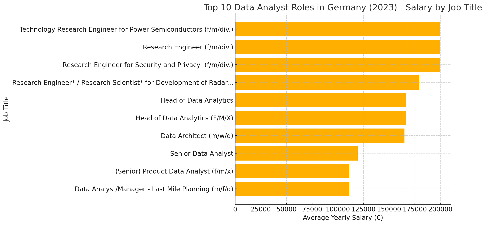

# 🚀Introduction
This project dives into **data analyst job postings from 2023**, uncovering the highest-paying roles, most in-demand skills, and skills offering the best combination of high demand and salary. These insights empower aspiring data analysts to strategically choose and prioritize their skill development for maximum career impact.

📂 **Explore the SQL queries behind this analysis:** [Project SQL Files](/project_sql/)


# 📖 Background
Driven by the need to strategically navigate the **data analyst job market**, this project was initiated to identify high-paying and highly demanded skills, aiming to streamline the path for analysts seeking optimal career growth.

The data used in this analysis originates from the [SQL Data Analyst Course](https://www.youtube.com/watch?v=7mz73uXD9DA&t=0s) by [lukebarousse](https://github.com/lukebarousse), encompassing detailed job postings with insights on job titles, salaries, locations, and essential skill requirements.

## Specifically, I set out to answer the following key questions through SQL queries:

1. What are the top-paying data analyst jobs located in Germany?

2. What skills are required for these top-paying roles?

3. What skills are most in demand across all data analyst positions?

4. Which skills correlate strongly with higher salaries?

5. What are the most optimal skills (high-demand and high-paying) to prioritize learning?


# 🛠️Tools I Used

Several essential tools and technologies learned during the **SQL Data Analyst Course** played key roles in conducting this analysis:

- **SQL:** Served as the analytical backbone, used extensively for querying data and uncovering critical insights.

- **PostgreSQL:** The database management system selected for its robustness and ease in handling large datasets of job postings.

- **Visual Studio Code:** The primary environment for developing and running SQL queries, ensuring smooth database interactions.

- **Git & GitHub:** Crucial for version control, effective project management, collaboration, and sharing my analysis and SQL scripts.

# 📊 The Analysis

Each SQL query in this project was strategically crafted to explore specific aspects of the data analyst job market. Below is how I approached answering each of the key analytical questions:

## 1- Top-Paying Data Analyst Jobs

To uncover the highest-paying roles, I filtered the dataset for positions explicitly titled "Data Analyst", located specifically in Germany, and with clearly stated average salaries. This allowed me to quickly identify top financial opportunities within the German market.

```sql
SELECT
    job_id,
    company_dim.name as company_name,
    job_title,
    job_location,
    job_schedule_type,
    salary_year_avg,
    job_posted_date
FROM job_postings_fact
LEFT JOIN company_dim ON company_dim.company_id = job_postings_fact.company_id
where
    job_title_short like '%Data Analyst%' AND
    search_location = 'Germany' AND
    salary_year_avg is NOT NULL
ORDER BY
     salary_year_avg DESC
```
### 📌Insights from Top-Paying Data Analyst Roles
Below is a brief summary of the most critical insights uncovered from analyzing the highest-paying Data Analyst roles:

#### 💰 Wide Salary Range
- Top salaries for data analyst positions in Germany range roughly between **€166,000 to €200,000 annually**.


#### 🏢 Diverse Employers
- **Bosch Group** frequently offers high-paying analytics roles, highlighting robust analytics demand in large industrial firms.

- Notable companies include **Fraunhofer-Gesellschaft** (research institute) and fintech firm** Volt.io**.

- Both established industrial leaders and innovative tech startups actively compete for top analytics talent.

#### 🎯 Job Title & Role Variety
Highest-paying roles extend beyond traditional Data Analyst positions, encompassing specialized titles such as:

- Technology Research Engineer for Power Semiconductors

- Research Engineer for Security and Privacy

- Head of Data Analytics

Employers increasingly seek candidates blending analytics with engineering, research, and leadership capabilities.


*Bar graph visualizing the salary for the top 10 salaries for data analysts in Germany; ChatGPT generated this graph from my SQL query results*

#### 📍 Locations
Lucrative opportunities are distributed across key German cities known for innovation and industry strength:

- **Renningen**, **Hildesheim** (engineering & industrial hubs)

- **Berlin** (especially strong for fintech and tech roles)

#### ⏱️ Job Schedule Types
Majority of these high-paying positions are strictly **full-time**, reflecting high responsibilities, specialized tasks, and leadership demands.

#### 📅 Job Posting Patterns
High-salary analytics roles are consistently advertised **year-round**, indicating a continuous and strong market demand for analytics expertise rather than seasonal hiring trends.

## 2. Skills for Top Paying Jobs
To determine what skills set apart the highest-paid data analyst roles, I joined job postings with their required skills. This analysis reveals exactly what employers value most for high-compensation positions in Germany.

```sql
WITH top_paying_job AS (
    SELECT
        job_id,
        company_dim.name as company_name,
        job_title,
        salary_year_avg
    FROM job_postings_fact
    LEFT JOIN company_dim ON company_dim.company_id = job_postings_fact.company_id
    where
        job_title_short like '%Data Analyst%' AND
        search_location = 'Germany' AND
        salary_year_avg is NOT NULL
    ORDER BY
        salary_year_avg DESC
)

SELECT
    top_paying_job.*,
    skills_dim.skills as skills_name
FROM top_paying_job
INNER JOIN skills_job_dim on top_paying_job.job_id = skills_job_dim.job_id
INNER JOIN skills_dim on skills_dim.skill_id = skills_job_dim.skill_id
```

- **SQL** stands out as the most essential skill, required in 31 of the highest-paying job postings.
- **Python** follows closely, needed for 20 of these roles and highlighting its dominance in analytics and data engineering.
- **Tableau** is the top visualization tool in demand, explicitly listed in 18 top-paying positions.


*Bar graph visualizing the count of skills for the top 10 paying jobs for data analysts; ChatGPT generated this graph from my SQL query results*

## 3. In-Demand Skills for Data Analysts
This query helped identify the skills most frequently requested in job postings, directing focus to areas with high demand.
```sql
select 
    skills as skills_name,
    count (skills_job_dim.job_id) as demand_count
from job_postings_fact
INNER JOIN skills_job_dim on job_postings_fact.job_id = skills_job_dim.job_id
INNER JOIN skills_dim on skills_dim.skill_id = skills_job_dim.skill_id
WHERE job_title_short LIKE '%Data Analyst%'
GROUP BY
    skills
ORDER BY
    demand_count DESC
limit 5
```

I analyzed the skill requirements from all relevant job postings. The results clearly show that foundational technical and analytical skills dominate employer expectations. SQL remains the core requirement for data analysis, while Excel, Python, and modern BI tools like Tableau and Power BI round out the essential skill set for strong employability.

| Skill     | Demand Count |
|-----------|--------------|
| SQL       | 110,380      |
| Excel     | 75,348       |
| Python    | 68,409       |
| Tableau   | 56,569       |
| Power BI  | 45,482       |

*Summary of the top five most in-demand skills (2023, Germany)*

## 4. Skills Based on Salary
Exploring the average salaries associated with different skills reveals which specializations are most highly rewarded for data analysts—across all locations in the dataset.

```sql
select 
    skills as skills_name,
    round(avg (job_postings_fact.salary_year_avg),0) as avg_salary
from job_postings_fact
INNER JOIN skills_job_dim on job_postings_fact.job_id = skills_job_dim.job_id
INNER JOIN skills_dim on skills_dim.skill_id = skills_job_dim.skill_id
WHERE 
    job_title_short LIKE '%Data Analyst%' and
    job_postings_fact.salary_year_avg is not null
GROUP BY
    skills
ORDER BY
    avg_salary DESC
limit 25
```
The results show that Some technical skills consistently stand out for commanding premium salaries in the data analyst job market. These include advanced version control systems, virtualization and infrastructure management, scalable deployment tools, modern programming frameworks, and blockchain technologies. Roles requiring expertise in these areas are typically highly specialized and less common but offer exceptional earning potential for those who possess them.

| Skill       | Average Salary (€) |
|-------------|-------------------|
| SVN         | 400,000           |
| VMware      | 261,250           |
| Yarn        | 219,575           |
| FastAPI     | 185,000           |
| Solidity    | 179,000           |
| Bitbucket   | 175,500           |
| Rust        | 175,000           |
| Typescript  | 171,000           |
| Atlassian   | 170,000           |
| GitLab      | 170,000           |
*Highest Paying Skills for Data Analysts (All Locations, 2023)*

## 5. Most Optimal Skills to Learn
By combining insights from both demand and salary data, I identified the skills that are not only most sought-after but also offer the highest compensation. Focusing your learning on these areas provides the best strategic return for career growth in data analytics.

```sql
with job_demand as(
    select 
        skills_dim.skills,
        skills_job_dim.skill_id,
        count (skills_job_dim.job_id) as demand_count
    from job_postings_fact
    INNER JOIN skills_job_dim on job_postings_fact.job_id = skills_job_dim.job_id
    INNER JOIN skills_dim on skills_dim.skill_id = skills_job_dim.skill_id
    WHERE 
        job_title_short LIKE '%Data Analyst%' and
        job_postings_fact.salary_year_avg is not null
    GROUP BY
    skills_job_dim.skill_id, skills_dim.skills
), job_salary AS (
    select 
        skills_job_dim.skill_id,
        round(avg (job_postings_fact.salary_year_avg),0) as avg_salary
    from job_postings_fact
    INNER JOIN skills_job_dim on job_postings_fact.job_id = skills_job_dim.job_id
    INNER JOIN skills_dim on skills_dim.skill_id = skills_job_dim.skill_id
    WHERE 
        job_title_short LIKE '%Data Analyst%' and
        job_postings_fact.salary_year_avg is not null
    GROUP BY
        skills_job_dim.skill_id
)
SELECT
    job_demand.skill_id,
   job_demand.skills,
    job_demand.demand_count,
    job_salary.avg_salary
FROM job_demand
INNER JOIN  job_salary ON job_demand.skill_id = job_salary.skill_id
ORDER BY demand_count DESC
```
### 1. Core Analytics
Mastering the basics is non-negotiable: SQL and Python are the cornerstones of data analysis, combining both high demand and strong average salaries. Excel remains essential for many roles, but modern BI tools like Tableau and Power BI significantly boost both employability and earning potential.

| Skill     | Demand Count | Avg. Salary ($) |
|-----------|--------------|-----------------|
| SQL       | 3,892        | 100,299         |
| Python    | 2,304        | 105,115         |
| Excel     | 2,467        | 88,924          |
| Tableau   | 2,155        | 101,543         |
| Power BI  | 1,273        | 95,348          |

### 2. Cloud & Databases
Cloud computing and advanced data platforms are less common requirements but are closely associated with top-tier salaries and specialized roles.

| Skill     | Demand Count | Avg. Salary ($) |
|-----------|--------------|-----------------|
| Azure     | 384          | 107,749         |
| GCP       | 92           | 113,367         |
| MongoDB   | 33           | 115,587         |
| Spark     | 231          | 116,744         |

### 3. Engineering Tools
Engineering and workflow automation tools are critical for advanced analytics and data engineering positions.

| Skill     | Demand Count | Avg. Salary ($) |
|-----------|--------------|-----------------|
| Airflow   | 100          | 121,658         |
| Docker    | 34           | 102,533         |
| Git       | 92           | 112,654         |
| Linux     | 66           | 114,018         |

# 🚀 What I Learned
Throughout this project, I’ve turbocharged my SQL toolkit and sharpened my analytical mindset:

- **🧩 Complex Query Crafting:** Mastered advanced SQL by joining multiple tables, designing subqueries, and using WITH clauses (CTEs) for clean, modular query building.

- **📊 Data Aggregation:** Became fluent in GROUP BY and aggregate functions like COUNT(), SUM(), and AVG(), making data summarization second nature.

- **💡 Analytical Wizardry:** Developed real-world problem-solving skills—translating business questions into actionable, insightful SQL queries.

- **🏷️ Data Cleaning & Filtering:** Learned how to filter, clean, and structure messy job market data for meaningful analysis.

- **🔍 Insight Communication:** Improved my ability to extract, interpret, and clearly communicate key insights for technical and non-technical audiences.

- **🛠️ Version Control & Collaboration:** Gained hands-on experience using Git & GitHub for sharing code, tracking changes, and collaborating in a professional data project.

# 🏁 Conclusions
## Insights
From this comprehensive five-step analysis, several key insights stand out:

1. Top-Paying Jobs:
The most lucrative data analyst roles are found in major industrial, engineering, research, and fintech organizations. Higher compensation is closely linked to seniority and specialized technical expertise.

2. Skills for High Salaries:
SQL, Python, and Tableau are consistently required for the best-paying roles, demonstrating that employers seek a blend of foundational analytics and advanced technical skills.

3. Most In-Demand Skills:
SQL, Excel, Python, Tableau, and Power BI make up the essential core for data analysts, dominating job requirements across the market.

4. Salary-Boosting Specializations:
Niche technical skills—such as DevOps tools, cloud platforms, advanced programming, and blockchain—deliver the highest average salaries, even though they’re less commonly requested.

5. Optimal Skills to Learn:
Mastering SQL and Python, alongside modern BI, cloud, and engineering tools, provides the broadest career opportunities and strongest earning potential.

## Closing Thoughts
This project sharpened my SQL and analytical skills, improved my approach to solving open-ended data questions, and deepened my ability to communicate actionable insights. By bridging technical expertise with real-world market analysis, I’m now even better equipped to tackle advanced data challenges and guide strategic skill development for data careers.